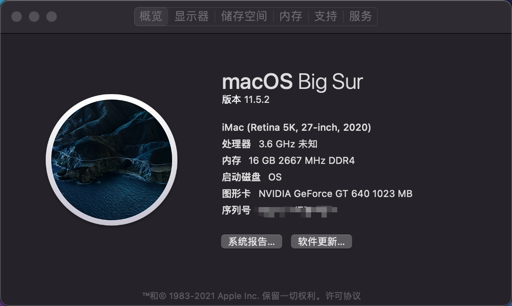
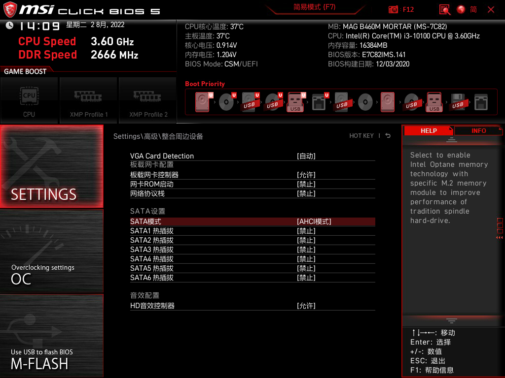
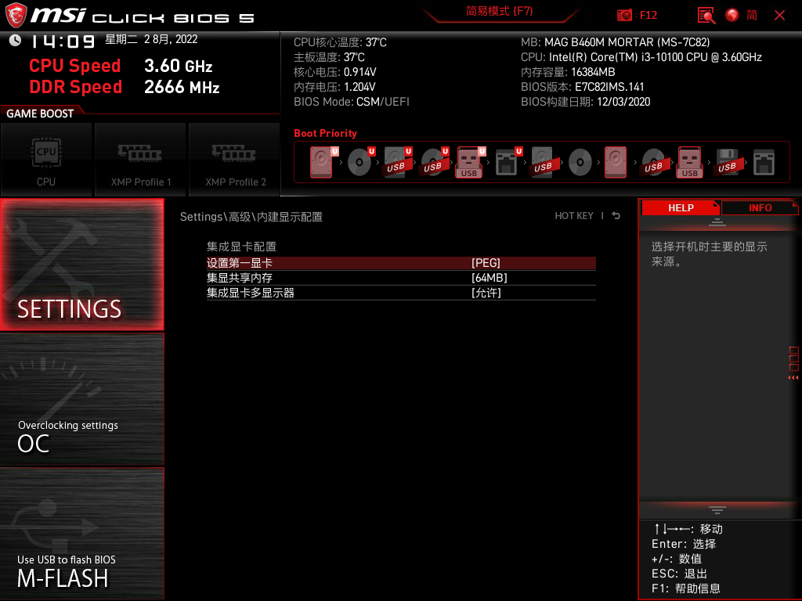
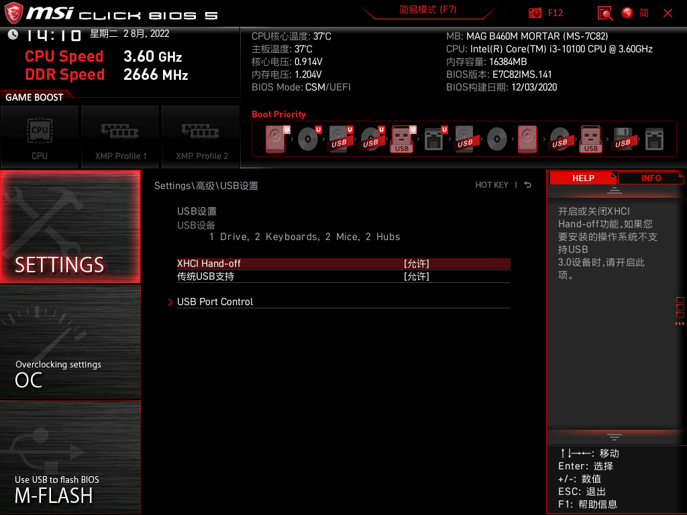
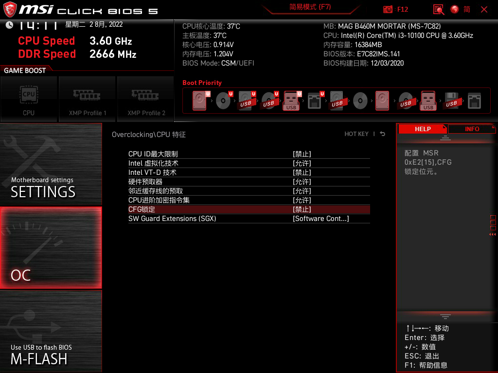
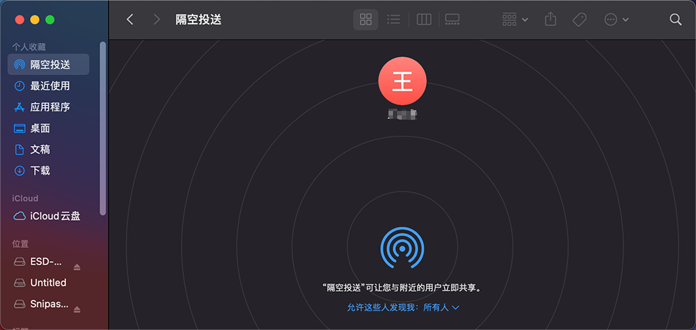
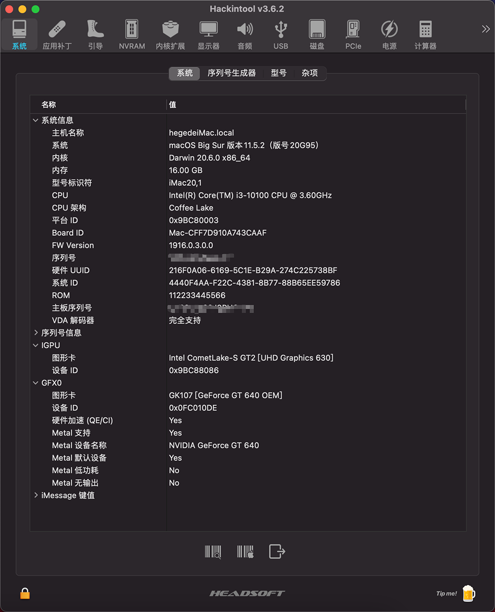
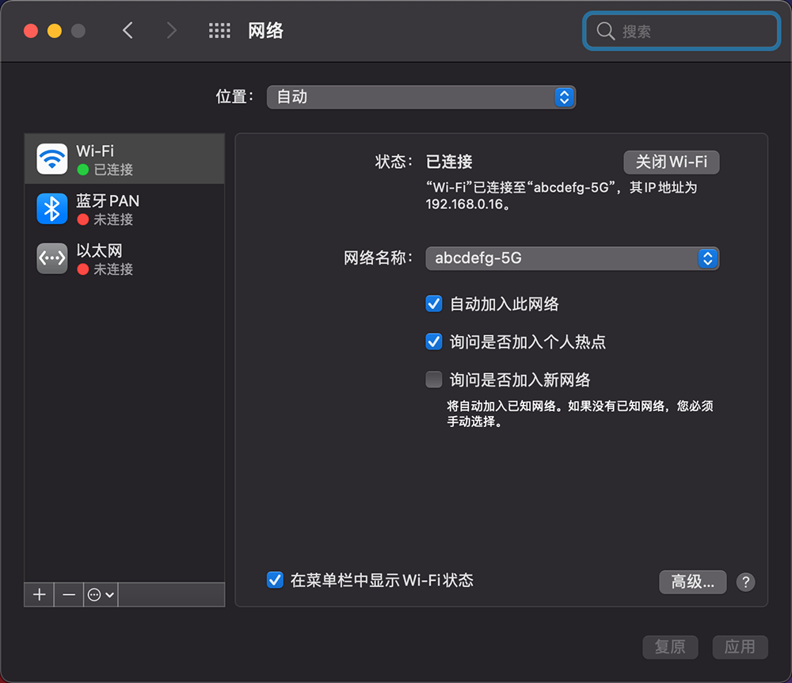
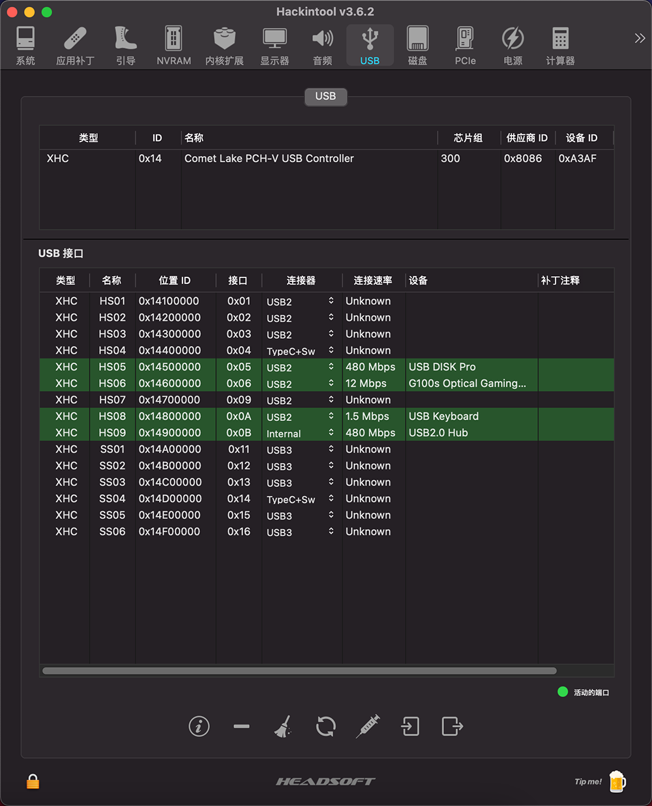

# Hackintosh-10100-B460M-MORTAR
## EFI 
- OpenCore: 0.6.0
- macOS version: 11.5.2 Big Sur

## 硬件配置
|组件|型号|
|------|------|
|主板|微星 B460M MORTAR|
|CPU|Intel i3 10100|
|内存|威刚万紫千红 8GB * 2 2666MHz|
|显卡| gt640 |
|SSD-m.2| 海康威视eco2000 512GB |
|电源|航嘉冷静王 350W|
|声卡|板载Realtek ALC1200|
|机箱|乔思伯u4|
|散热|利民AX120 R SE 标配|
|网卡| BCM94360CS2|

## 安装注意
[BigSur安装注意事项.pdf](./BigSur安装注意事项.pdf)

[BigSur安装注意事项.png](./BigSur安装注意事项.png)
## Bios设置

## oc定制工具
[Hackintool](./Hackintool)

[OpenCoreConfigurator_v0.7.1](./OpenCoreConfigurator_v0.7.1)
## 功能测试
- ✅ usb定制
- ✅ 无线网卡
- ✅ 板载网卡（以太网）
- ✅ 隔空投送
- ✅ 接力
- ✅ 核显硬件加速
- ✅ DP 4K输出
- ✅ HIDPI
- ✅ 声卡驱动
- ✅ 睡眠唤醒

- [] 蓝牙
- [] 随航
- [] 摄像头
- [] 麦克风

